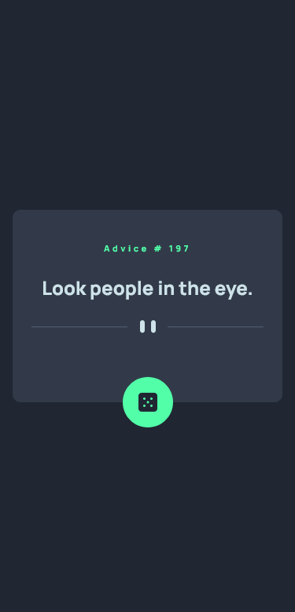
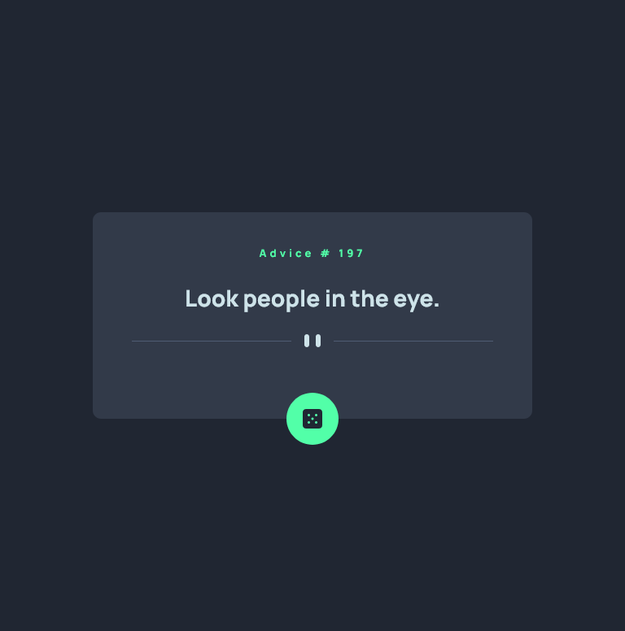
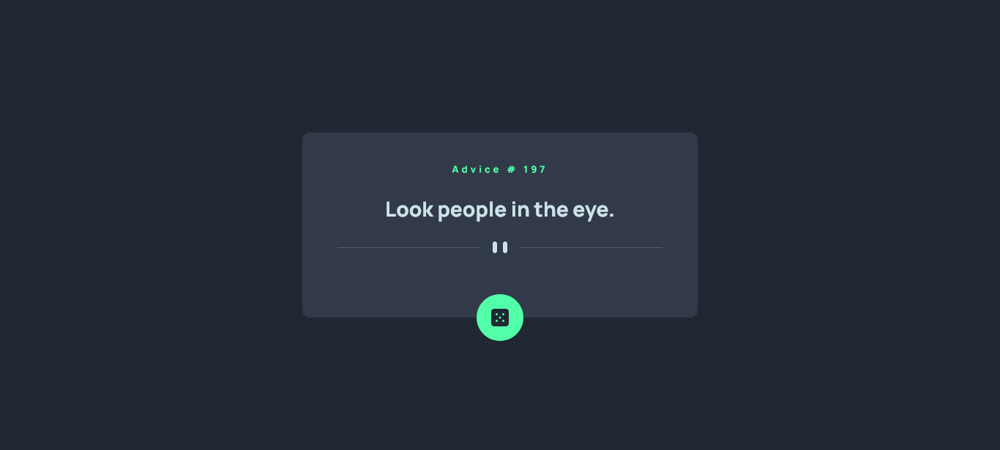

# Frontend Mentor - Advice generator app solution

This is a solution to the [Advice generator app challenge on Frontend Mentor](https://www.frontendmentor.io/challenges/advice-generator-app-QdUG-13db). Frontend Mentor challenges help you improve your coding skills by building realistic projects.

## Table of contents

- [Overview](#overview)
  - [The challenge](#the-challenge)
  - [Screenshot](#screenshot)
  - [Links](#links)
- [My process](#my-process)
  - [Built with](#built-with)
  - [What I learned](#what-i-learned)
  - [Continued development](#continued-development)
  - [Useful resources](#useful-resources)
- [Author](#author)
- [Acknowledgments](#acknowledgments)

## Overview

### The challenge

Users should be able to:

- 

### Screenshot

### Links

- Solution URL: [Add solution URL here](https://your-solution-url.com)
- [Live Site URL](https://queseri.github.io/Advice-generator-app/)

## My process

### Built with

- Semantic HTML5 markup
- CSS custom properties
- Flexbox
- Mobile-first workflow

### What I learned

The advice was not changing when clicking the button, to fix the issue , i had to add the following object to the fetch call  `{cache: "no-cache"}`. The edited cal looked like `const fetchAdvice = await fetch("https://api.adviceslip.com/advice", {cache: "no-cache"})`

### Continued development

### Useful resources

- api used `https://api.adviceslip.com`

## Author

- Website - [Chamu Mutezva](https://github.com/ChamuMutezva)
- Frontend Mentor - [@ChamuMutezva](https://www.frontendmentor.io/profile/ChamuMutezva)
- Twitter - [@ChamuMutezva](https://twitter.com/ChamuMutezva)

## Acknowledgments

Frontend Mentor
